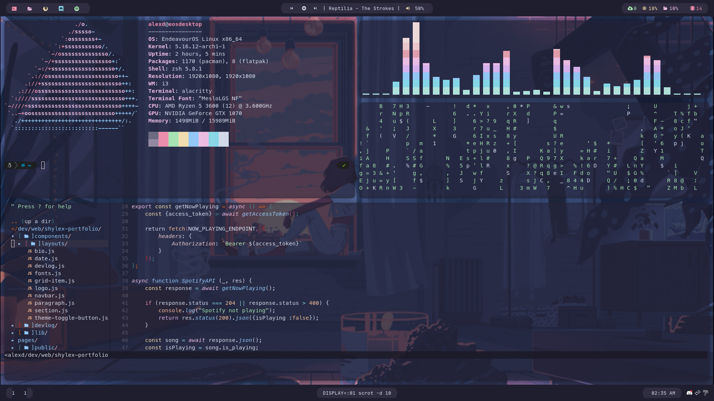

# dotfiles  
  
Config Files for my Linux install  
  

  
I am not good at design, therefore a decent chunk is taken from [Anchovyyy](https://www.github.com/Anchovyyy/rice)  
  
Thank god for [Catppuccin](https://github.com/Catppuccin/Catppuccin), maybe its overused but having a color palette without having to think of it myself does make life a lot easier.
I have also of course modified stuff to make it work for *me* specifically  
  
This repo includes configs for the following:  
- Dunst - Notifications
- Cava - Audio Visualiser (Obviously more optional)
- Alacritty - My terminal of choice
- i3-gaps - Tiling Window Manager
- NeoVim - Editor, pretty much set up to be an IDE by my configs
- Picom - Compositor, used for the nice round corners and opacity on windows, especially based on focus. (This uses the yshui ver.)
- Polybar - Bar for top and bottom of desktop
- Rofi - Application Launcher, Power menu, Window Menu
  
Additional info:  
- I use feh to set my wallpaper (which is from the [catppuccin wallpaper repo](https://www.github.com/Catppuccin/Wallpapers))  
- If you are using the Neovim config, Install Vim-Plug and then run :PlugInstall to install the plugins, custom hotkeys are pretty common but also mostly explained in comments in the file.  
- To make C/CPP work fully in neovim, install llvm and clang  
- Install Oh-My-Zsh and Powerline10k to use my shell  
- The polybar-scripts folder contains a script to get the current song on spotify  
  
Rofi Hotkeys:  
  
Mod+Shift+E: Power menu  
  
Mod+Tab: Window menu  
  
Mod+D: App Menu  
  
